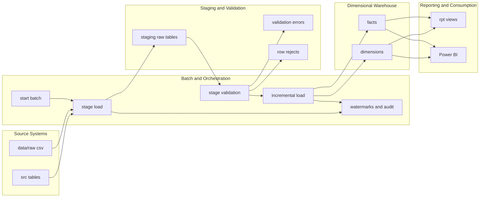

# Transportation Data Warehouse

End-to-end transportation analytics warehouse built for SQL Server, SSIS, T-SQL, and Power BI. The repo models shipments, carriers, routes, locations, shipment status events, and delivery exceptions in a Kimball-style warehouse with batch control, watermarks, stage validation, audit logging, incremental restatement, SQL-based testing, and Power BI/SSIS build guidance.

## Project Overview

This project demonstrates a realistic SQL Server warehouse workflow:

- mixed source inputs from relational tables and flat files
- a batch-aware staging layer with validation and reject handling
- a dimensional warehouse for shipment, route, and exception analysis
- incremental loading with rerun safety and shipment restatement
- analytics-ready views plus a documented Power BI semantic model

## Business Problem

Transportation operations teams often have shipment data spread across operational tables, scan-event feeds, and exception files. That makes it hard to answer basic questions consistently:

- Which carriers are missing delivery targets?
- Which routes are over benchmark on distance or transit time?
- Which exception categories create the most disruption?
- Which shipments have issues such as missed scans, weather delays, or address problems?

This repo solves that by standardizing source data, validating it in staging, loading a Kimball-style warehouse, and exposing reporting-friendly outputs for SQL validation and Power BI.

## What Is Implemented Vs Manual

Implemented in this repo:

- SQL source schema under `src`
- stage landing, validation, reject capture, and metadata under `stg`, `meta`, and `audit`
- warehouse dimensions and facts under `dw`
- incremental orchestration in `etl.usp_Run_Incremental_Load`
- SQL-based test suite and data-quality checks
- reporting views under `rpt`
- Power BI semantic model, DAX, and dashboard design docs
- SSIS package design and SSDT build docs

Still manual in desktop tools:

- actual `.dtsx` package creation in SSDT
- actual `.pbix` report creation in Power BI Desktop
- screenshot capture after local runs

## Architecture



More detail is in `docs/ARCHITECTURE.md`.

## Source Systems

Relational source layer:

- `src.Carrier`
- `src.Location`
- `src.Route`
- `src.Shipment`
- `src.Shipment_Status_History`
- `src.Delivery_Exception`

Flat-file source layer:

- `data/raw/carrier_lookup.csv`
- `data/raw/locations.csv`
- `data/raw/routes.csv`
- `data/raw/shipments.csv`
- `data/raw/daily_delivery_scan_events.csv`
- `data/raw/delivery_exceptions.csv`
- `data/raw/exception_code_lookup.csv`
- `data/raw/route_distance_reference.csv`

Synthetic data generation is handled by `data/generator/generate_transport_data.py`.

## Staging, Validation, And Reject Handling

The `stg` layer is the controlled landing zone between operational sources and the warehouse.

Key design choices:

- raw business keys are preserved
- every staged row carries `BatchID`, `SourceName`, and load metadata
- invalid operational rows are rejected before warehouse loading
- row-level reject reasons are written back to stage and also logged centrally

Main stage tables:

- `stg.Carrier_Raw`
- `stg.Location_Raw`
- `stg.Route_Raw`
- `stg.Shipment_Raw`
- `stg.Shipment_Status_History_Raw`
- `stg.Delivery_Exception_Raw`
- `stg.Exception_Code_Lookup_Raw`
- `stg.Route_Distance_Reference_Raw`

Validation and rejects:

- `etl.usp_Validate_Stage_Data`
- `audit.Validation_Error`
- `audit.Stage_Row_Reject`

Invalid mandatory business references are rejected in stage. Unknown warehouse members are used only as a later safety net for analytic lookups.

## Warehouse Model

The warehouse follows a simple Kimball-style star design.

Dimensions:

- `dw.DimDate`
- `dw.DimCarrier`
- `dw.DimLocation`
- `dw.DimRoute`
- `dw.DimDeliveryException`
- `dw.DimShipmentStatus`

Facts:

- `dw.FactShipment`
  One row per shipment number.
- `dw.FactDeliveryEvent`
  One row per shipment status event.
- `dw.FactDeliveryException`
  One row per shipment exception occurrence.

This model supports executive KPIs and detailed operational drill-through without parallel fact tables for the same business process.

## ETL Design

The ETL flow is intentionally SQL-driven:

- SSIS handles ingestion and orchestration
- T-SQL handles validation, dimensional mastering, fact loading, watermarks, and audit outputs

Two stage-load paths are supported:

1. Relational source path
   `meta.usp_Start_Batch` -> `etl.usp_Load_Stage_From_Source` -> `etl.usp_Run_Incremental_Load`
2. Flat-file SSIS path
   `meta.usp_Start_Batch` -> land CSV feeds into `stg` -> `etl.usp_Register_Flat_File_Stage_Load` -> `etl.usp_Validate_Stage_Data` -> `etl.usp_Run_Incremental_Load`

Business rules implemented in SQL include:

- carrier and route standardization
- on-time and delayed shipment derivation
- transit day and delay minute calculation
- exception flagging and normalized exception-category mapping
- duplicate prevention for shipments, events, and exceptions
- shipment restatement when later events or exceptions arrive

## Incremental Loads

Incremental hardening is built into the existing ETL framework, not layered on top of it.

Watermark strategy:

- shipment master: `SourceModifiedAt + ShipmentID`
- shipment status history: `EventDateTime + ShipmentStatusHistoryID`
- delivery exceptions: `ExceptionDateTime + DeliveryExceptionID`
- flat files: successful `BatchID + FileName` registration per source object

Important behavior:

- source watermarks are promoted only after a successful warehouse batch
- rerunning `etl.usp_Run_Incremental_Load` for an already staged batch is safe
- late-arriving events or exceptions restate `dw.FactShipment` without requiring a full reload

## Validation And Error Handling

The repo already includes SQL-based validation assets:

- `tests/sql/01_smoke_tests.sql`
- `tests/sql/02_row_count_checks.sql`
- `tests/sql/03_referential_integrity_checks.sql`
- `tests/sql/04_incremental_load_checks.sql`
- `tests/sql/05_reporting_view_checks.sql`
- `sql/04_tests/00_data_quality_checks.sql`

Key metadata and audit objects:

- `meta.Batch_Run`
- `meta.Watermark`
- `meta.Source_File_Log`
- `audit.Load_Audit`
- `audit.Validation_Error`
- `audit.Stage_Row_Reject`
- `audit.Error_Log`

## SSIS Implementation Approach

The recommended SSIS package inventory is documented, not autogenerated:

- `load_source_to_stage.dtsx`
- `validate_stage_data.dtsx`
- `load_dimensions.dtsx`
- `load_facts.dtsx`
- `incremental_daily_load.dtsx`

`incremental_daily_load.dtsx` is the main walkthrough package. The package design intentionally calls the existing SQL procedures instead of duplicating transformation logic inside SSIS.

Use these docs when building SSDT assets:

- `docs/ssis-package-design.md`
- `docs/ssis-build-checklist.md`
- `docs/ssis-screens-to-create.md`

## Power BI Reporting Layer

For this portfolio build, Power BI should connect directly to the `dw` fact and dimension tables in `Import` mode.

Use the `rpt` views only for KPI cross-checking and SQL-side validation:

- `rpt.vw_DeliveryPerformance`
- `rpt.vw_RouteEfficiency`
- `rpt.vw_CarrierExceptionTrends`

Documented Power BI assets:

- `powerbi/model-design.md`
- `powerbi/dax-measures.md`
- `powerbi/dashboard-spec.md`
- `docs/powerbi-build-steps.md`

Planned report pages:

- Executive Overview
- Delivery Performance
- Route Efficiency
- Carrier Exceptions
- Operational Detail

## Local Setup And Run Order

1. Generate source data:

   ```powershell
   python .\data\generator\generate_transport_data.py --output-dir .\data\generated --raw-output-dir .\data\raw --sql-seed-path .\sql\source\02_seed_source_data.sql
   ```

2. Build the database:

   ```powershell
   Push-Location .\sql
   sqlcmd -S localhost -E -b -v DatabaseName=TransportationDW -i .\99_run_all.sql
   Pop-Location
   ```

3. Seed the source schema:

   ```powershell
   sqlcmd -S localhost -E -b -d TransportationDW -i .\sql\source\02_seed_source_data.sql
   ```

4. Run the first warehouse batch:

   ```powershell
   sqlcmd -S localhost -E -d TransportationDW -Q "DECLARE @BatchID int; EXEC meta.usp_Start_Batch @BatchName=N'INITIAL_SRC_LOAD', @SourceName=N'SRC_OLTP', @BatchID=@BatchID OUTPUT; EXEC etl.usp_Load_Stage_From_Source @BatchID=@BatchID, @SourceName=N'SRC_OLTP', @RunValidation=0; EXEC etl.usp_Run_Incremental_Load @BatchID=@BatchID; SELECT @BatchID AS BatchID;"
   ```

5. Run the SQL test suite:

   ```powershell
   sqlcmd -S localhost -E -i .\tests\sql\01_smoke_tests.sql
   sqlcmd -S localhost -E -i .\tests\sql\05_reporting_view_checks.sql
   sqlcmd -S localhost -E -v DatabaseName=TransportationDW -i .\sql\04_tests\00_data_quality_checks.sql
   ```

6. Build SSDT and Power BI Desktop artifacts manually by following:

   - `docs/demo-setup-guide.md`
   - `docs/ssis-build-checklist.md`
   - `docs/powerbi-build-steps.md`

## Sample Business Questions Answered

- Which carriers have the lowest on-time delivery rates?
- Which service levels and destinations drive the highest delay minutes?
- Which routes exceed benchmark distance or transit expectations?
- Which exception categories affect each carrier most often?
- Which shipments had missed scans, damage events, address issues, or weather delays?
- Which routes have enough benchmark coverage to support reliable efficiency analysis?

## Portfolio And Demo Notes

Best docs to open during a demo:

- `docs/demo-setup-guide.md`
- `DEMO_RUNBOOK.md`
- `docs/ARCHITECTURE.md`
- `docs/interview-qa.md`
- `docs/resume-bullet-mapping.md`
- `docs/screenshot-checklist.md`

Best SQL artifacts to show live:

- `meta.Batch_Run`
- `meta.Watermark`
- `audit.Load_Audit`
- `audit.Stage_Row_Reject`
- `dw.FactShipment`
- `dw.FactDeliveryEvent`
- `rpt.vw_DeliveryPerformance`

## Key Repo Guides

- `PROJECT_SPEC.md`
- `DEMO_RUNBOOK.md`
- `docs/IMPLEMENTATION_PLAN.md`
- `docs/TOOLS_AND_SETUP.md`
- `docs/staging-design.md`
- `docs/dimensional-model.md`
- `docs/business-rules.md`
- `docs/incremental-load-design.md`
- `docs/testing-strategy.md`
- `docs/ssis-package-design.md`
- `docs/powerbi-build-steps.md`

## Resume-Bullet Alignment

The repo is explicitly structured to support this resume story:

- SQL Server transportation warehouse with fact and dimension tables
- SSIS ETL package design for flat files and relational extracts
- incremental load workflows with validation, audit, and error handling
- analytics-ready outputs for delivery performance, route efficiency, and carrier exception reporting

Use `docs/resume-bullet-mapping.md` for a line-by-line mapping from that story to actual repo assets.
