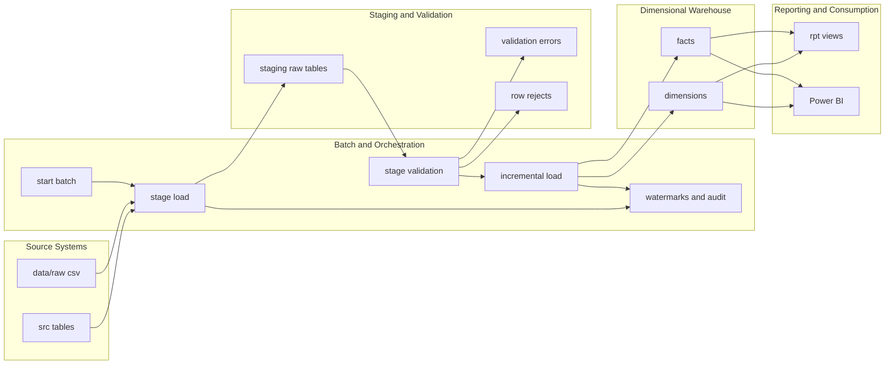

# Architecture Notes

## High-Level Architecture

## Layer Responsibilities

- `src`
  Normalized source-system tables that simulate the operational transportation system.
- `stg`
  Raw landed records by batch, preserving business keys and source context.
- `meta`
  Batch control, processed-file ledger, and incremental watermarks.
- `audit`
  Step-level load counts, validation failures, row-level rejects, and runtime errors.
- `etl`
  Stored procedures that perform validation, dimension loading, fact loading, and watermark promotion.
- `dw`
  Kimball-style dimensional warehouse tables for analytics.
- `rpt`
  SQL reporting views used for KPI validation and lightweight SQL-side reporting.

## Two Ingestion Paths

### Relational source path

Use the existing `src` schema and call:

- `meta.usp_Start_Batch`
- `etl.usp_Load_Stage_From_Source`
- `etl.usp_Run_Incremental_Load`

This path uses source timestamps and source-table identities for watermark-based delta detection.

### Flat-file path

Use SSIS packages to land the raw CSV feeds in `data/raw` into the same `stg` tables.

The package flow should:

- start a batch
- load one file per stage table
- log each file with `etl.usp_Register_Flat_File_Stage_Load`
- call `etl.usp_Validate_Stage_Data`
- call `etl.usp_Run_Incremental_Load`

The flat-file path uses file registration and batch tracking rather than source-table timestamps.

## Staging And Validation Flow

The stage layer is designed to keep ingestion simple and warehouse logic centralized.

Key behavior:

- raw rows land first
- semantic validation runs in SQL Server
- invalid mandatory rows are rejected
- reject reasons are written to `audit.Validation_Error`, `audit.Stage_Row_Reject`, and the stage row itself
- valid rows move to warehouse loading

This keeps business rules versioned in SQL and avoids hiding transformation logic inside SSIS canvases.

## Warehouse Flow

The warehouse model uses:

- conformed dimensions for date, carrier, location, route, shipment status, and exception
- shipment-level facts for performance metrics
- event-level facts for scan history
- exception-level facts for carrier and issue trend analysis

`dw.FactShipment` is restated when later events or exceptions arrive so shipment-level KPIs stay accurate without a full reload.

## Incremental And Rerun Design

The incremental framework is intentionally simple and interview-friendly:

- SQL-source feeds use timestamp plus identity watermarks
- flat-file feeds use processed-file registration
- pending watermarks are promoted only after a successful warehouse batch
- facts load with business-key-based merge logic
- rerunning the same batch does not duplicate shipment, event, or exception facts
- impacted shipments are restaged and recalculated when later operational activity arrives

## Reporting And Consumption

The reporting layer has two audiences:

- SQL validation users, through the `rpt` views
- Power BI users, through a semantic model built directly on `dw` tables

For this repo, the recommended Power BI design is:

- primary model on `dw` tables
- `rpt` views used only as validation references

That keeps the semantic model aligned to the warehouse grain while still showing that curated reporting datasets exist.

## Why This Architecture Is Credible

- It matches a common SQL Server + SSIS + Power BI workflow.
- It separates landing, validation, warehouse, and reporting concerns clearly.
- It uses audit tables and watermarks instead of hidden package state.
- It supports both relational and flat-file feeds without maintaining two warehouse designs.
- It is small enough for a local demo and detailed enough for interview discussion.

## Current Manual Boundary

The SQL implementation in this repo is buildable from source-controlled scripts.

The remaining desktop-tool steps are still manual:

- create the `.dtsx` packages in SSDT by following `docs/ssis-package-design.md`
- create the `.pbix` file in Power BI Desktop by following `docs/powerbi-build-steps.md`
- capture portfolio screenshots after actual local runs
